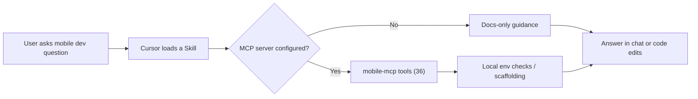

<p align="center">
  
</p>

<h1 align="center">Mobile App Developer Tools</h1>

<p align="center">
  <em>Go from zero to a running mobile app on your phone.</em>
</p>

<p align="center">
  <a href="https://github.com/TMHSDigital/Mobile-App-Developer-Tools/releases"></a>
  <a href="https://creativecommons.org/licenses/by-nc-nd/4.0/"></a>
  <a href="https://github.com/TMHSDigital/Mobile-App-Developer-Tools/actions/workflows/ci.yml"></a>
  <a href="https://github.com/TMHSDigital/Mobile-App-Developer-Tools/actions/workflows/validate.yml"></a>
  <a href="https://github.com/TMHSDigital/Mobile-App-Developer-Tools/actions/workflows/codeql.yml"></a>
</p>

<p align="center">
  <a href="https://www.npmjs.com/package/@tmhs/mobile-mcp"></a>
  <a href="https://www.npmjs.com/package/@tmhs/mobile-dev-tools"></a>
</p>

---

<p align="center">
  <strong>43 skills</strong> &nbsp;&bull;&nbsp; <strong>12 rules</strong> &nbsp;&bull;&nbsp; <strong>36 MCP tools</strong>
</p>

<p align="center">
  <a href="#skills">Skills</a> · <a href="#rules">Rules</a> · <a href="#companion-mobile-mcp-server">MCP Tools</a> · <a href="#installation">Install</a> · <a href="#roadmap">Roadmap</a>
</p>

---

## Overview

Mobile App Developer Tools is a **Cursor** plugin by **TMHSDigital** that packages agent skills, editor rules, and a TypeScript **MCP server** (`mcp-server/`) so you can scaffold, build, and ship mobile apps without leaving the IDE. Currently at **v1.0.0** with forty-three skills (React Native/Expo + Flutter), twelve rules, and thirty-six live MCP tools.

**What you get**

| Layer | Role |
| --- | --- |
| **Skills** | 43 guided workflows for React Native/Expo and Flutter: project setup through monetization, analytics, OTA updates, testing, CI/CD, animations, maps, i18n, forms, real-time, security, offline sync, background tasks, debugging, production monitoring, theming, feature flags, accessibility testing, native modules, config plugins, and SDK upgrades |
| **Rules** | 12 guardrails: secrets, platform guards, image bloat, env safety, performance, accessibility, bundle size, test coverage, i18n strings, security audit, color contrast, native compatibility |
| **MCP** | 36 tools: env checks, scaffolding, device deploy, screen/component gen, permissions, AI, build health, push, deep links, store builds, metadata validation, App Store + Play Store submission, screenshots, bundle analysis, OTA config, test runner, CI setup, test file generation, i18n setup, map integration, form generation, real-time client, security audit, performance profiling, offline readiness, APM monitoring, theming, accessibility audit, feature flags, native module scaffolding, SDK upgrade, native compat audit |

**Quick facts**

| Item | Detail |
| --- | --- |
| **License** | [CC-BY-NC-ND-4.0](LICENSE) |
| **Author** | [TMHSDigital](https://github.com/TMHSDigital) |
| **Repository** | [github.com/TMHSDigital/Mobile-App-Developer-Tools](https://github.com/TMHSDigital/Mobile-App-Developer-Tools) |
| **Runtime** | Node 20+ for MCP server |
| **Framework** | Expo (React Native) + Flutter |

### How it works



<details>
<summary>Expand: end-to-end mental model</summary>

1. Install the plugin (symlink into your Cursor plugins directory).
2. Open a mobile dev task; **rules** such as `mobile-secrets` run as you edit.
3. Invoke a **skill** by name (for example `mobile-project-setup` or `mobile-run-on-device`) when you need a structured workflow.
4. Optionally wire **MCP** so tools like `checkDevEnvironment`, `scaffoldProject`, or `runOnDevice` can take real actions on your machine.

</details>

<br>

---

## Compatibility

| Client | Skills | Rules | MCP server (`mcp-server/`) |
| --- | --- | --- | --- |
| **Cursor** | Yes (native plugin) | Yes (`.mdc` rules) | Yes, via MCP config |
| **Claude Code** | Yes, copy `skills/` | Yes, via `CLAUDE.md` | Yes, any MCP-capable host |
| **Other MCP clients** | Manual import | Manual import | Yes, stdio transport |

---

## Quick Start

<details>
<summary><strong>Clone, symlink, build, and try it</strong></summary>

**1. Clone**

```bash
git clone https://github.com/TMHSDigital/Mobile-App-Developer-Tools.git
cd Mobile-App-Developer-Tools
```

**2. Symlink the plugin (pick your OS)**

Windows PowerShell (run as Administrator if your policy requires it):

```powershell
New-Item -ItemType SymbolicLink `
  -Path "$env:USERPROFILE\.cursor\plugins\mobile-app-developer-tools" `
  -Target (Get-Location)
```

macOS / Linux:

```bash
ln -s "$(pwd)" ~/.cursor/plugins/mobile-app-developer-tools
```

**3. Build the MCP server**

```bash
cd mcp-server
npm install
npm run build
```

**4. Try it**

Open Cursor and ask:

```
"Create a new Expo app with TypeScript and file-based routing"
"Check if my dev environment is ready for mobile development"
"How do I run this app on my phone?"
```

</details>

---

## Demo App

See the plugin in action: **[SnapLog](https://github.com/TMHSDigital/Demo-Mobile-App)** is a photo journal app built entirely using these skills and MCP tools. It exercises 16 of the 43 skills - from project scaffolding and navigation to camera capture, AI descriptions, local storage, and push notifications.

[](https://github.com/TMHSDigital/Demo-Mobile-App)

---

## Skills

All 43 skills are production-ready. Names match the folder under `skills/`.

<details>
<summary><strong>React Native / Expo skills (15)</strong></summary>

| Skill | Framework | What it does |
| --- | --- | --- |
| `mobile-project-setup` | Expo | Guided project creation with TypeScript, file-based routing, ESLint |
| `mobile-dev-environment` | Shared | Detect OS, check dependencies (Node, Watchman, Xcode, Android Studio), fix common issues |
| `mobile-run-on-device` | Expo | Step-by-step for physical device via Expo Go, dev builds, QR code, tunnel mode |
| `mobile-navigation-setup` | Expo | Expo Router file-based navigation: tabs, stack, drawer, typed routes, deep linking |
| `mobile-state-management` | Shared | When to use React state vs Zustand vs Jotai vs React Query with code examples |
| `mobile-component-patterns` | Shared | Reusable component architecture, compound components, StyleSheet vs NativeWind, testing |
| `mobile-camera-integration` | Expo | expo-camera setup, permissions, photo capture, barcode scanning, video recording |
| `mobile-ai-features` | Shared | AI API integration (OpenAI, Anthropic, Google) with backend proxy, vision, text, audio |
| `mobile-permissions` | Shared | Cross-platform permission requests, iOS rationale strings, denied/blocked state handling |
| `mobile-auth-setup` | Shared | Authentication with Supabase, Firebase, Clerk; secure token storage, protected routes |
| `mobile-push-notifications` | Expo | expo-notifications, EAS Push, Android channels, deep link on tap, local notifications |
| `mobile-local-storage` | Shared | AsyncStorage, expo-sqlite, expo-secure-store, MMKV; migrations and data cleanup |
| `mobile-api-integration` | Shared | REST/GraphQL clients, React Query, auth headers, retry, offline queue, optimistic updates |
| `mobile-ios-submission` | Expo | EAS Build/Submit, certificates, provisioning profiles, TestFlight, App Store review |
| `mobile-android-submission` | Expo | Play Console, signing keys, AAB, service accounts, staged rollouts |

</details>

<details>
<summary><strong>Flutter skills (4)</strong></summary>

| Skill | What it does |
| --- | --- |
| `mobile-flutter-project-setup` | Guided `flutter create` with feature-first structure, linting, packages, flavors |
| `mobile-flutter-navigation` | GoRouter: declarative routing, shell routes for tabs, auth guards, deep linking |
| `mobile-flutter-run-on-device` | USB/wireless debugging, hot reload vs restart, build modes, troubleshooting |
| `mobile-flutter-state-management` | Riverpod (recommended), Bloc, Provider, setState; async data, code generation |

</details>

<details>
<summary><strong>Shared skills (24)</strong></summary>

| Skill | What it does |
| --- | --- |
| `mobile-app-store-prep` | App icons, screenshots, metadata, privacy policy, age ratings, review guidelines |
| `mobile-monetization` | In-app purchases, subscriptions, RevenueCat, StoreKit 2, sandbox testing, price localization |
| `mobile-deep-links` | Universal links (iOS), app links (Android), URL schemes, deferred deep links, install attribution |
| `mobile-analytics` | Crash reporting (Sentry, Firebase Crashlytics), event tracking (PostHog), source maps, GDPR compliance |
| `mobile-ota-updates` | EAS Update channels, runtime versions, staged rollouts, rollback, Shorebird for Flutter |
| `mobile-testing` | Unit and integration testing with Jest, React Native Testing Library, flutter_test, snapshot testing |
| `mobile-e2e-testing` | End-to-end testing with Detox, Maestro, Patrol; device farm setup (BrowserStack, AWS Device Farm) |
| `mobile-ci-cd` | GitHub Actions workflows, EAS Build pipelines, build caching, code signing in CI, PR preview builds |
| `mobile-animations` | Reanimated 3, Lottie, Rive for React Native; implicit/explicit animations, Hero transitions for Flutter |
| `mobile-maps-location` | react-native-maps, google_maps_flutter, expo-location, geofencing, background location tracking |
| `mobile-i18n` | i18next, flutter_localizations, locale detection, RTL layout, pluralization, date/number formatting |
| `mobile-forms-validation` | React Hook Form + Zod, Form + TextFormField, keyboard avoidance, multi-step wizard forms |
| `mobile-real-time` | WebSockets, Supabase Realtime, Socket.IO, SSE, reconnection, presence indicators |
| `mobile-security` | SSL pinning, code obfuscation, jailbreak/root detection, certificate transparency, secure key storage |
| `mobile-offline-sync` | Offline-first architecture, background sync, conflict resolution, operation queuing, optimistic UI |
| `mobile-background-tasks` | Background fetch, WorkManager (Android), BGTaskScheduler (iOS), headless JS, Flutter Workmanager |
| `mobile-debugging` | Flipper, React DevTools, Flutter DevTools, memory leak detection, network inspection |
| `mobile-app-monitoring` | Production APM with Sentry Performance, Datadog RUM, Instabug; OpenTelemetry spans, Apdex scoring |
| `mobile-theming` | Design tokens, dark mode, system appearance detection, NativeWind for RN, Material 3 for Flutter, persistent preference |
| `mobile-feature-flags` | Feature toggles with PostHog, LaunchDarkly, Firebase Remote Config; A/B testing, staged rollouts, kill switches |
| `mobile-accessibility-testing` | Automated a11y audits, WCAG 2.1 AA compliance, screen reader testing (VoiceOver/TalkBack), CI integration |
| `mobile-native-modules` | Expo Modules API (Swift/Kotlin), Turbo Modules, JSI bridging, native view components, platform plugins |
| `mobile-config-plugins` | Config plugin authoring, CNG patterns, Xcode/Gradle automation, modifier previews |
| `mobile-sdk-upgrade` | SDK version migration, dependency audit, breaking change detection, rollback strategy |

</details>

<details>
<summary><strong>Example prompts</strong> - one per skill</summary>

| Skill | Try this |
| --- | --- |
| `mobile-project-setup` | "Set up a new Expo project for a camera app" |
| `mobile-dev-environment` | "Is my Mac ready for iOS development?" |
| `mobile-run-on-device` | "My phone can't connect to the dev server - help" |
| `mobile-navigation-setup` | "Add tab navigation with Home, Search, and Profile tabs" |
| `mobile-state-management` | "What state management should I use for my Expo app?" |
| `mobile-component-patterns` | "Create a reusable Card component with header and footer" |
| `mobile-camera-integration` | "Add a QR code scanner to my app" |
| `mobile-ai-features` | "I want to take a photo and have AI describe what's in it" |
| `mobile-permissions` | "How do I handle camera permission properly on iOS and Android?" |
| `mobile-auth-setup` | "Add email/password auth with Supabase and protected routes" |
| `mobile-push-notifications` | "Set up push notifications that open a specific screen on tap" |
| `mobile-local-storage` | "I need offline storage for a todo list with secure login" |
| `mobile-api-integration` | "Connect to my REST API with auth headers and offline support" |
| `mobile-app-store-prep` | "What do I need to submit my app to the App Store?" |
| `mobile-ios-submission` | "Submit my Expo app to the App Store for the first time" |
| `mobile-android-submission` | "Publish my app on Google Play with staged rollout" |
| `mobile-flutter-project-setup` | "Create a new Flutter app with Riverpod and GoRouter" |
| `mobile-flutter-navigation` | "Add tab navigation with GoRouter in my Flutter app" |
| `mobile-flutter-run-on-device` | "My Android phone doesn't show up in flutter devices" |
| `mobile-flutter-state-management` | "Should I use Riverpod or Bloc for my Flutter app?" |
| `mobile-monetization` | "Add a monthly subscription with a free trial using RevenueCat" |
| `mobile-deep-links` | "Make shared links like example.com/recipe/42 open in my app" |
| `mobile-analytics` | "Set up crash reporting with Sentry and event tracking with PostHog" |
| `mobile-ota-updates` | "Push a bug fix to production without going through app review" |
| `mobile-testing` | "Add unit tests for my components and hooks" |
| `mobile-e2e-testing` | "Set up Maestro E2E tests for my login flow" |
| `mobile-ci-cd` | "Create a GitHub Actions workflow that tests on PR and builds on merge" |
| `mobile-animations` | "Add a fade-in animation when cards appear and swipe-to-dismiss" |
| `mobile-maps-location` | "Show a map with the user's location and let them drop pins" |
| `mobile-i18n` | "Add English and Spanish language support with proper pluralization" |
| `mobile-forms-validation` | "Build a registration form with email, password, and validation" |
| `mobile-real-time` | "Add live chat with typing indicators using Supabase Realtime" |
| `mobile-security` | "Harden my app for production - check for security vulnerabilities" |
| `mobile-offline-sync` | "Make my app work offline and sync when back online" |
| `mobile-background-tasks` | "Sync data every 15 minutes even when the app is closed" |
| `mobile-debugging` | "My app is getting slower over time - help me find the memory leak" |
| `mobile-app-monitoring` | "Set up production monitoring with Sentry so I know when things break" |
| `mobile-theming` | "Add dark mode support with design tokens and system appearance detection" |
| `mobile-feature-flags` | "Set up feature flags with PostHog so I can do staged rollouts" |
| `mobile-accessibility-testing` | "Run an accessibility audit on my app and fix any WCAG violations" |
| `mobile-native-modules` | "Create a native module to access the device gyroscope" |
| `mobile-config-plugins` | "Add Apple Pay entitlement and a custom URL scheme via config plugins" |
| `mobile-sdk-upgrade` | "Upgrade my Expo app from SDK 50 to the latest version" |

</details>

---

## Rules

All 12 rules are production-ready.

<details>
<summary><strong>All 12 rules</strong></summary>

| Rule | Scope | What it catches |
| --- | --- | --- |
| `mobile-secrets` | Always on | API keys, signing credentials, keystore passwords, Firebase config, `.p8`/`.p12` files, EAS tokens |
| `mobile-platform-check` | `.ts`, `.tsx` | Platform-specific APIs (BackHandler, ToastAndroid, StatusBar methods) used without `Platform.OS` or `Platform.select()` guards |
| `mobile-image-assets` | `.ts`, `.tsx`, `.json` | Oversized images (>500KB), unoptimized formats (BMP, TIFF), missing `@2x`/`@3x` variants, uncached remote images |
| `mobile-env-safety` | `.ts`, `.tsx`, `.json` | Hardcoded production endpoints, missing `EXPO_PUBLIC_` prefix, server-only secrets in client code |
| `mobile-performance` | `.ts`, `.tsx`, `.dart` | Inline styles, missing list keys, ScrollView for long lists (RN); missing const constructors, inline widgets (Flutter) |
| `mobile-accessibility` | `.ts`, `.tsx`, `.dart` | Missing a11y labels on interactive elements, small touch targets, images without alt text, color-only indicators |
| `mobile-bundle-size` | `.ts`, `.tsx`, `.json`, `.dart` | Large dependencies (moment, lodash, aws-sdk), unoptimized imports, heavy packages with lighter alternatives |
| `mobile-test-coverage` | `.ts`, `.tsx`, `.dart` | Untested components and screens, missing test files, low coverage thresholds, snapshot-only testing |
| `mobile-i18n-strings` | `.ts`, `.tsx`, `.dart` | Hardcoded user-facing strings not wrapped in a translation function, string concatenation for sentences, missing plural forms |
| `mobile-security-audit` | `.ts`, `.tsx`, `.dart`, `.json`, `.xml` | Insecure storage (tokens in AsyncStorage), missing SSL pinning, debug flags in release builds, cleartext traffic, hardcoded signing credentials |
| `mobile-color-contrast` | `.ts`, `.tsx`, `.dart` | Insufficient color contrast ratios, missing dark mode variants, non-semantic color usage, hardcoded colors without theme tokens |
| `mobile-native-compat` | `.ts`, `.tsx`, `.dart` | Deprecated native APIs, bridge-only module patterns, New Architecture incompatibilities, sunset React Native/Flutter APIs |

</details>

---

## Companion: Mobile MCP Server

[](https://www.npmjs.com/package/@tmhs/mobile-mcp)

The MCP server gives your AI assistant the ability to take real actions on your local machine. No API keys required.

**Setup**

Add to `.cursor/mcp.json`:

```json
{
  "mcpServers": {
    "mobile": {
      "command": "node",
      "args": ["./mcp-server/dist/index.js"],
      "cwd": "<path-to>/Mobile-App-Developer-Tools"
    }
  }
}
```

Or install globally via npm:

```bash
npx @tmhs/mobile-mcp
```

<details>
<summary><strong>All 36 MCP tools</strong></summary>

| Tool | Purpose |
| --- | --- |
| `mobile_checkDevEnvironment` | Detect installed tools and SDKs (Node, Expo CLI, Watchman, Xcode, Android Studio, JDK). Report what is missing with install instructions. |
| `mobile_scaffoldProject` | Generate a new Expo project with TypeScript template and recommended config. |
| `mobile_runOnDevice` | Start dev server and provide step-by-step instructions for connecting a physical device. |
| `mobile_generateScreen` | Create a new Expo Router screen file with correct convention, navigation wiring, and boilerplate. |
| `mobile_generateComponent` | Create a React Native component with typed props interface, StyleSheet, and optional test file. |
| `mobile_installDependency` | Install a package via `npx expo install` with native module detection and Expo Go compatibility warnings. |
| `mobile_addPermission` | Add a platform permission to app.json with iOS rationale string via Expo config plugins. |
| `mobile_integrateAI` | Scaffold an AI API client with provider config, error handling, timeout, and TypeScript types. |
| `mobile_checkBuildHealth` | Validate app.json, check dependencies, verify TypeScript compiles, detect native module issues. |
| `mobile_addPushNotifications` | Add expo-notifications plugin to app.json, create notification handler, configure Android channel. |
| `mobile_configureDeepLinks` | Set URL scheme, add Android intent filters, iOS associated domains, generate AASA template. |
| `mobile_resetDevEnvironment` | Nuclear reset: clear Metro cache, .expo dir, node_modules cache, optionally Pods and Gradle. |
| `mobile_buildForStore` | Create a production build for app store submission via EAS Build. Validates app.json before building. |
| `mobile_validateStoreMetadata` | Check app.json for all required store listing fields (name, bundle ID, version, icon, splash, privacy policy). |
| `mobile_submitToAppStore` | Submit the latest iOS production build to App Store Connect via EAS Submit. |
| `mobile_submitToPlayStore` | Submit the latest Android production build to Google Play Console via EAS Submit. |
| `mobile_generateScreenshots` | Generate a screenshot capture helper script and list required store dimensions for iOS and Android. |
| `mobile_analyzeBundle` | Analyze app bundle for large dependencies, heavy assets, and optimization opportunities. |
| `mobile_configureOTA` | Configure EAS Update for over-the-air JavaScript updates with channels and runtime version policy. |
| `mobile_runTests` | Execute test suite (Jest for Expo, flutter test for Flutter) and return structured pass/fail summary with failure details. |
| `mobile_setupCI` | Generate a GitHub Actions CI workflow for build, test, and optional EAS Build deployment. |
| `mobile_generateTestFile` | Scaffold a test file for an existing component or module with imports and placeholder test cases. |
| `mobile_setupI18n` | Initialize i18n config with locale files, translation structure, and language detection. |
| `mobile_addMap` | Add a map view with provider config, location permissions, and marker support. |
| `mobile_generateForm` | Scaffold a validated form component with typed fields, Zod schema, and error handling. |
| `mobile_setupRealtime` | Add a real-time client module with connection management, reconnection, and typed events. |
| `mobile_securityAudit` | Scan project for common mobile security anti-patterns: insecure storage, missing SSL pinning, debug flags, cleartext traffic. |
| `mobile_profilePerformance` | Analyze project for performance anti-patterns: slow lists, unnecessary re-renders, uncached images, animation issues. |
| `mobile_checkOfflineReady` | Validate offline-first readiness: local database, network status listener, query caching, mutation queue. |
| `mobile_setupMonitoring` | Configure APM with Sentry Performance or Datadog RUM. Generate monitoring module with error capture, tracing, and release health. |
| `mobile_setupTheming` | Initialize design token system with light/dark themes, semantic colors, spacing, typography, and persistent theme preference. |
| `mobile_auditAccessibility` | Scan project for a11y violations: missing labels, small touch targets, images without alt text, color-only indicators. Reports WCAG level. |
| `mobile_setupFeatureFlags` | Add typed feature flag provider with default values, remote sync, and provider integration (PostHog, LaunchDarkly, Firebase). |
| `mobile_createNativeModule` | Scaffold an Expo Module or Flutter platform plugin with Swift/Kotlin stubs and TypeScript/Dart bindings. |
| `mobile_upgradeSDK` | Detect current SDK version, generate step-by-step upgrade plan with dependency fixes, breaking changes, and rollback strategy. |
| `mobile_checkNativeCompat` | Audit installed packages for New Architecture (Fabric/TurboModules) support. Flag bridge-only and deprecated dependencies. |

</details>

---

## NPM Package

[](https://www.npmjs.com/package/@tmhs/mobile-dev-tools)

The `@tmhs/mobile-dev-tools` package provides shared CLI utilities for mobile development.

```bash
npm install -g @tmhs/mobile-dev-tools
mobile-dev --help
```

Full functionality (environment checker, template engine, store metadata validator) is coming in future releases. See [ROADMAP.md](ROADMAP.md).

---

## Installation

| Step | Action |
| --- | --- |
| 1 | Clone [Mobile-App-Developer-Tools](https://github.com/TMHSDigital/Mobile-App-Developer-Tools) |
| 2 | Symlink the repo per [Quick Start](#quick-start) |
| 3 | Restart Cursor |
| 4 | (Optional) Register MCP: point your client at `mcp-server/dist/index.js` after `npm run build` |

Plugin manifest: [`.cursor-plugin/plugin.json`](.cursor-plugin/plugin.json).

---

## Configuration

No API keys are required for local development. Store submission tools require platform-specific credentials.

Future versions may use:

| Variable | Required | Description |
| --- | --- | --- |
| `EXPO_TOKEN` | For EAS builds | Expo access token for CI/CD |
| `APPLE_ID` | For iOS submission | Apple Developer account email |
| `GOOGLE_SERVICE_ACCOUNT` | For Android submission | Play Console service account JSON |

---

## Roadmap

<details>
<summary><strong>Release history and upcoming versions</strong></summary>

Full details in [ROADMAP.md](ROADMAP.md).

| Version | Theme | Highlights | Status |
| --- | --- | --- | --- |
| **v0.1.0** | Zero to Phone | 3 skills, 1 rule, 3 MCP tools | |
| **v0.2.0** | Navigate & State | 6 skills, 2 rules, 6 MCP tools | |
| **v0.3.0** | Camera & AI | 9 skills, 3 rules, 9 MCP tools | |
| **v0.4.0** | Users & Data | 13 skills, 4 rules, 12 MCP tools | |
| **v0.5.0** | Flutter | 17 skills, 5 rules, 12 MCP tools | |
| **v0.6.0** | Ship It | 20 skills, 6 rules, 15 MCP tools | |
| **v0.7.0** | Grow & Measure | 24 skills, 7 rules, 19 MCP tools | |
| **v0.8.0** | Test & Automate | 27 skills, 8 rules, 22 MCP tools | |
| **v0.9.0** | Rich Features | 32 skills, 9 rules, 26 MCP tools | |
| **v0.10.0** | Harden | 37 skills, 10 rules, 30 MCP tools | |
| **v0.11.0** | Design & Adapt | 40 skills, 11 rules, 33 MCP tools | |
| **v0.12.0** | Extend & Evolve | 43 skills, 12 rules, 36 MCP tools | |
| **v1.0.0** | Stable | 43 skills, 12 rules, 36 MCP tools | **Current** |
| **v1.0.0** | Stable | 43 skills, 12 rules, 36 MCP tools | |
| **v1.1.0** | Polish & Platform | 48 skills, 13 rules, 39 MCP tools | |
| **v1.2.0** | Data & Payments | 53 skills, 14 rules, 43 MCP tools | |
| **v1.3.0** | Engage & Comply | 58 skills, 15 rules, 46 MCP tools | |
| **v1.4.0** | Connect & Input | 62 skills, 16 rules, 49 MCP tools | |
| **v1.5.0** | Specialize | 65 skills, 17 rules, 52 MCP tools | |
| **v2.0.0** | Complete | 65 skills, 17 rules, 52 MCP tools | |

</details>

---

## Contributing

Issues and PRs are welcome. See [CONTRIBUTING.md](CONTRIBUTING.md) for guidelines on adding skills, rules, and MCP tools.

---

## License

Copyright (c) TM Hospitality Strategies. Licensed under **CC-BY-NC-ND-4.0** - see [LICENSE](LICENSE).

---

<p align="center">

**Mobile App Developer Tools** · Built by [TMHSDigital](https://github.com/TMHSDigital) · [Repository](https://github.com/TMHSDigital/Mobile-App-Developer-Tools)

</p>
