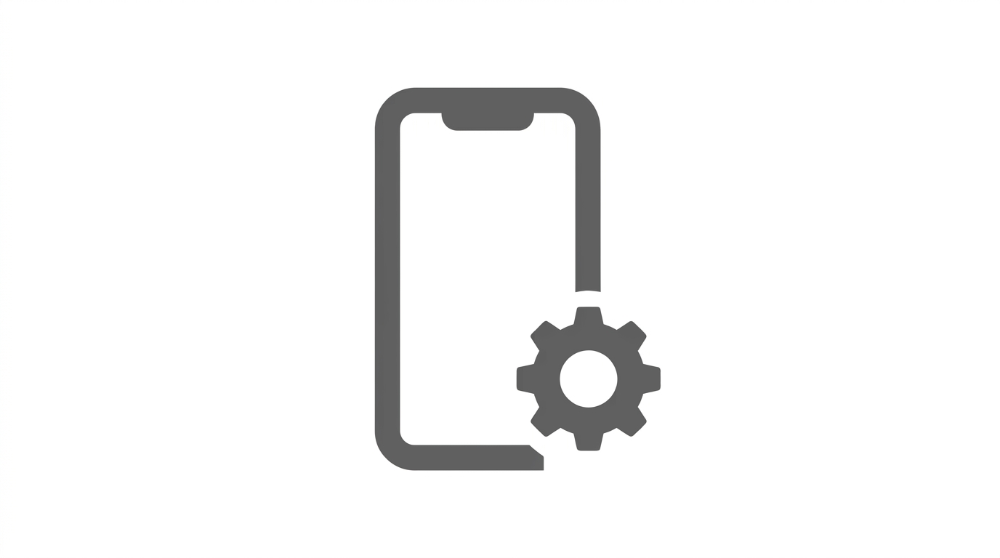
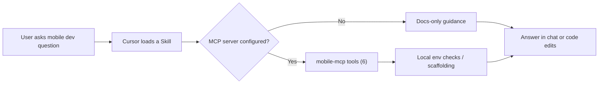

<p align="center">
  
</p>

<h1 align="center">Mobile App Developer Tools</h1>

<p align="center">
  <em>Go from zero to a running mobile app on your phone.</em>
</p>

<p align="center">
  <a href="https://github.com/TMHSDigital/Mobile-App-Developer-Tools/releases"></a>
  <a href="https://creativecommons.org/licenses/by-nc-nd/4.0/"></a>
  <a href="https://github.com/TMHSDigital/Mobile-App-Developer-Tools/actions/workflows/ci.yml"></a>
  <a href="https://github.com/TMHSDigital/Mobile-App-Developer-Tools/actions/workflows/validate.yml"></a>
  <a href="https://github.com/TMHSDigital/Mobile-App-Developer-Tools/actions/workflows/codeql.yml"></a>
</p>

<p align="center">
  <a href="https://www.npmjs.com/package/@tmhs/mobile-mcp"></a>
  <a href="https://www.npmjs.com/package/@tmhs/mobile-dev-tools"></a>
</p>

---

<p align="center">
  <strong>6 skills</strong> &nbsp;&bull;&nbsp; <strong>2 rules</strong> &nbsp;&bull;&nbsp; <strong>6 MCP tools</strong>
</p>

<p align="center">
  <a href="#skills">Skills</a> · <a href="#rules">Rules</a> · <a href="#companion-mobile-mcp-server">MCP Tools</a> · <a href="#installation">Install</a> · <a href="#roadmap">Roadmap</a>
</p>

---

## Overview

Mobile App Developer Tools is a **Cursor** plugin by **TMHSDigital** that packages agent skills, editor rules, and a TypeScript **MCP server** (`mcp-server/`) so you can scaffold, run, and debug mobile apps without leaving the IDE. Currently at **v0.2.0** with six skills, two rules, and six live MCP tools. Flutter support is planned for v0.5.0.

<br>
<table>
<tr>
<td>

**What you get**

| Layer | Role |
| --- | --- |
| **Skills** | Guided workflows: project scaffolding, environment setup, device deployment, navigation, state management, component patterns |
| **Rules** | Guardrails: `mobile-secrets` catches hardcoded secrets; `mobile-platform-check` flags missing platform guards |
| **MCP** | Six tools for environment checks, project creation, device connection, screen/component generation, dependency installation |

</td>
<td>

**Quick facts**

| Item | Detail |
| --- | --- |
| **License** | [CC-BY-NC-ND-4.0](LICENSE) |
| **Author** | [TMHSDigital](https://github.com/TMHSDigital) |
| **Repository** | [github.com/TMHSDigital/Mobile-App-Developer-Tools](https://github.com/TMHSDigital/Mobile-App-Developer-Tools) |
| **Runtime** | Node 20+ for MCP server |
| **Framework** | Expo (React Native) + TypeScript |

</td>
</tr>
</table>
<br>

### How it works



<details>
<summary>Expand: end-to-end mental model</summary>

1. Install the plugin (symlink into your Cursor plugins directory).
2. Open a mobile dev task; **rules** such as `mobile-secrets` run as you edit.
3. Invoke a **skill** by name (for example `mobile-project-setup` or `mobile-run-on-device`) when you need a structured workflow.
4. Optionally wire **MCP** so tools like `checkDevEnvironment`, `scaffoldProject`, or `runOnDevice` can take real actions on your machine.

</details>

<br>

---

## Compatibility

| Client | Skills | Rules | MCP server (`mcp-server/`) |
| --- | --- | --- | --- |
| **Cursor** | Yes (native plugin) | Yes (`.mdc` rules) | Yes, via MCP config |
| **Claude Code** | Yes, copy `skills/` | Yes, via `CLAUDE.md` | Yes, any MCP-capable host |
| **Other MCP clients** | Manual import | Manual import | Yes, stdio transport |

---

## Quick Start

**1. Clone**

```bash
git clone https://github.com/TMHSDigital/Mobile-App-Developer-Tools.git
cd Mobile-App-Developer-Tools
```

**2. Symlink the plugin (pick your OS)**

Windows PowerShell (run as Administrator if your policy requires it):

```powershell
New-Item -ItemType SymbolicLink `
  -Path "$env:USERPROFILE\.cursor\plugins\mobile-app-developer-tools" `
  -Target (Resolve-Path .\Mobile-App-Developer-Tools)
```

macOS / Linux:

```bash
ln -s "$(pwd)" ~/.cursor/plugins/mobile-app-developer-tools
```

**3. Build the MCP server**

```bash
cd mcp-server
npm install
npm run build
```

**4. Try it**

Open Cursor and ask:

```
"Create a new Expo app with TypeScript and file-based routing"
"Check if my dev environment is ready for mobile development"
"How do I run this app on my phone?"
```

---

## Skills

All 6 skills are production-ready. Names match the folder under `skills/`.

<details>
<summary><strong>All 6 skills</strong></summary>

| Skill | Framework | What it does |
| --- | --- | --- |
| `mobile-project-setup` | Expo | Guided project creation with TypeScript, file-based routing, ESLint |
| `mobile-dev-environment` | Shared | Detect OS, check dependencies (Node, Watchman, Xcode, Android Studio), fix common issues |
| `mobile-run-on-device` | Expo | Step-by-step for physical device via Expo Go, dev builds, QR code, tunnel mode |
| `mobile-navigation-setup` | Expo | Expo Router file-based navigation: tabs, stack, drawer, typed routes, deep linking |
| `mobile-state-management` | Shared | When to use React state vs Zustand vs Jotai vs React Query with code examples |
| `mobile-component-patterns` | Shared | Reusable component architecture, compound components, StyleSheet vs NativeWind, testing |

</details>

**Example prompts** - one per skill:

| Skill | Try this |
| --- | --- |
| `mobile-project-setup` | "Set up a new Expo project for a camera app" |
| `mobile-dev-environment` | "Is my Mac ready for iOS development?" |
| `mobile-run-on-device` | "My phone can't connect to the dev server - help" |
| `mobile-navigation-setup` | "Add tab navigation with Home, Search, and Profile tabs" |
| `mobile-state-management` | "What state management should I use for my Expo app?" |
| `mobile-component-patterns` | "Create a reusable Card component with header and footer" |

---

## Rules

Both rules are production-ready.

<details>
<summary><strong>All 2 rules</strong></summary>

| Rule | Scope | What it catches |
| --- | --- | --- |
| `mobile-secrets` | Always on | API keys, signing credentials, keystore passwords, Firebase config, `.p8`/`.p12` files, EAS tokens |
| `mobile-platform-check` | `.ts`, `.tsx` | Platform-specific APIs (BackHandler, ToastAndroid, StatusBar methods) used without `Platform.OS` or `Platform.select()` guards |

</details>

---

## Companion: Mobile MCP Server

[](https://www.npmjs.com/package/@tmhs/mobile-mcp)

The MCP server gives your AI assistant the ability to take real actions on your local machine. No API keys required.

**Setup**

Add to `.cursor/mcp.json`:

```json
{
  "mcpServers": {
    "mobile": {
      "command": "node",
      "args": ["./mcp-server/dist/index.js"],
      "cwd": "<path-to>/Mobile-App-Developer-Tools"
    }
  }
}
```

Or install globally via npm:

```bash
npx @tmhs/mobile-mcp
```

<details>
<summary><strong>All 6 MCP tools</strong></summary>

| Tool | Purpose |
| --- | --- |
| `mobile_checkDevEnvironment` | Detect installed tools (Node, Expo CLI, Watchman, Xcode, Android Studio, JDK). Report what is missing with install instructions. |
| `mobile_scaffoldProject` | Generate a new Expo project with TypeScript template and recommended config. |
| `mobile_runOnDevice` | Start dev server and provide step-by-step instructions for connecting a physical device. |
| `mobile_generateScreen` | Create a new Expo Router screen file with correct convention, navigation wiring, and boilerplate. |
| `mobile_generateComponent` | Create a React Native component with typed props interface, StyleSheet, and optional test file. |
| `mobile_installDependency` | Install a package via `npx expo install` with native module detection and Expo Go compatibility warnings. |

</details>

---

## NPM Package

[](https://www.npmjs.com/package/@tmhs/mobile-dev-tools)

The `@tmhs/mobile-dev-tools` package provides shared CLI utilities for mobile development.

```bash
npm install -g @tmhs/mobile-dev-tools
mobile-dev --help
```

Full functionality (environment checker, template engine, store metadata validator) is coming in future releases. See [ROADMAP.md](ROADMAP.md).

---

## Installation

| Step | Action |
| --- | --- |
| 1 | Clone [Mobile-App-Developer-Tools](https://github.com/TMHSDigital/Mobile-App-Developer-Tools) |
| 2 | Symlink the repo per [Quick Start](#quick-start) |
| 3 | Restart Cursor |
| 4 | (Optional) Register MCP: point your client at `mcp-server/dist/index.js` after `npm run build` |

Plugin manifest: [`.cursor-plugin/plugin.json`](.cursor-plugin/plugin.json).

---

## Configuration

No API keys are required for v0.2.0. All tools work locally.

Future versions may use:

| Variable | Required | Description |
| --- | --- | --- |
| `EXPO_TOKEN` | For EAS builds | Expo access token for CI/CD |
| `APPLE_ID` | For iOS submission | Apple Developer account email |
| `GOOGLE_SERVICE_ACCOUNT` | For Android submission | Play Console service account JSON |

---

## Roadmap

Summary aligned with [ROADMAP.md](ROADMAP.md):

| Version | Theme | Highlights | Status |
| --- | --- | --- | --- |
| **v0.1.0** | Zero to Phone | 3 skills, 1 rule, 3 MCP tools | |
| **v0.2.0** | Navigate & State | 6 skills, 2 rules, 6 MCP tools | **Current** |
| **v0.3.0** | Camera & AI | Camera integration, AI features, permissions | |
| **v0.4.0** | Users & Data | Auth, push notifications, local storage, API integration | |
| **v0.5.0** | Flutter | Flutter project setup, navigation, device deploy, state management | |
| **v0.6.0** | Ship It | App store prep, iOS and Android submission | |
| **v0.7.0** | Grow | Monetization, deep links, bundle analysis | |
| **v1.0.0** | Stable | 22 skills, 7 rules, 18 MCP tools | |

---

## Contributing

Issues and PRs are welcome. See [CONTRIBUTING.md](CONTRIBUTING.md) for guidelines on adding skills, rules, and MCP tools.

---

## License

Copyright (c) TM Hospitality Strategies. Licensed under **CC-BY-NC-ND-4.0** - see [LICENSE](LICENSE).

---

<p align="center">

**Mobile App Developer Tools** · Built by [TMHSDigital](https://github.com/TMHSDigital) · [Repository](https://github.com/TMHSDigital/Mobile-App-Developer-Tools)

</p>
