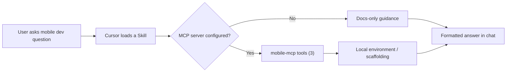

# Mobile App Developer Tools

**Go from zero to a running mobile app on your phone.**

Version License: CC BY-NC-ND 4.0 CI Validate

**3 skills** - **1 rule** - **3 MCP tools**

---

## Overview

Mobile App Developer Tools is a **Cursor** plugin by **TMHSDigital** that packages agent skills, editor rules, and a TypeScript **MCP server** so you can scaffold, run, and debug mobile apps without leaving the IDE. Currently supports React Native/Expo. Flutter support is planned for v0.5.0.

The first 30 minutes of mobile development is broken. You're Googling "how to set up Expo," fighting simulator configs, wondering why your app won't hot-reload on your phone, and drowning in framework choices before you've written a single line of business logic. This toolkit eliminates that friction.

## Quick Start

Install the plugin, then ask anything about mobile development:

```
"Create a new Expo app with TypeScript and file-based routing"
"Check if my dev environment is ready for mobile development"
"How do I run this app on my phone?"
```

## How It Works



**Skills** teach Cursor how to handle mobile dev prompts. **Rules** enforce best practices as you code. The **MCP server** provides real actions (environment checks, project scaffolding, device connection) so skills can do work, not give advice.

---

## Compatibility

| Component | Cursor | Claude Code | Other MCP clients |
|-----------|--------|-------------|-------------------|
| **CLAUDE.md** context | Yes | Yes | - |
| **3 Skills** (SKILL.md) | Yes | Yes | - |
| **1 Rule** (.mdc) | Yes | Via CLAUDE.md | - |
| **3 MCP tools** | Yes | Yes | Yes |

---

## Skills

**3 skills** for v0.1.0. All Expo-focused.

| Skill | Framework | What it does |
|-------|-----------|--------------|
| mobile-project-setup | Expo | Guided project creation with TypeScript, file-based routing, ESLint |
| mobile-dev-environment | Shared | Detect OS, check dependencies (Node, Watchman, Xcode, Android Studio), fix common issues |
| mobile-run-on-device | Expo | Step-by-step for physical device via Expo Go, dev builds, QR code, tunnel mode |

**Example prompts:**

```
"Set up a new Expo project for a camera app"
"Is my Mac ready for iOS development?"
"My phone can't connect to the dev server - help"
```

---

## Rules

**1 rule** for v0.1.0.

| Rule | Scope | What it catches |
|------|-------|-----------------|
| mobile-secrets | Always on | API keys, signing credentials, keystore passwords, Firebase config, `.p8`/`.p12` files, EAS tokens |

---

## Companion: Mobile MCP Server

The MCP server gives your AI assistant the ability to take real actions on your local machine.

Add to your Cursor MCP config (`.cursor/mcp.json`):

```json
{
  "mcpServers": {
    "mobile": {
      "command": "node",
      "args": ["./mcp-server/dist/index.js"],
      "cwd": "<path-to>/Mobile-App-Developer-Tools"
    }
  }
}
```

### MCP Tools (3)

| Tool | Purpose |
|------|---------|
| mobile_checkDevEnvironment | Detect installed tools (Node, Expo CLI, Watchman, Xcode, Android Studio, JDK). Report what is missing with install instructions. |
| mobile_scaffoldProject | Generate a new Expo project with TypeScript template and recommended config. |
| mobile_runOnDevice | Start dev server and provide step-by-step instructions for connecting a physical device. |

---

## NPM Package

The `@tmhsdigital/mobile-dev-tools` package provides shared utilities for mobile development. Currently a stub to reserve the name. Full functionality coming in future releases.

```bash
npm install -g @tmhsdigital/mobile-dev-tools

# CLI usage (coming soon)
mobile-dev check-env
mobile-dev scaffold --framework expo --template default
```

---

## Installation

> **Marketplace listing pending review.** Use manual installation.

Clone the repo and symlink it to your local plugins directory:

```bash
git clone https://github.com/TMHSDigital/Mobile-App-Developer-Tools.git
```

**Windows (PowerShell as Admin)**

```powershell
New-Item -ItemType SymbolicLink `
  -Path "$env:USERPROFILE\.cursor\plugins\mobile-app-developer-tools" `
  -Target (Resolve-Path .\Mobile-App-Developer-Tools)
```

**macOS / Linux**

```bash
ln -s "$(pwd)/Mobile-App-Developer-Tools" ~/.cursor/plugins/mobile-app-developer-tools
```

Build the MCP server:

```bash
cd mcp-server
npm install
npm run build
```

---

## Configuration

No API keys are required for v0.1.0. All tools work locally.

Future versions may use:

| Variable | Required | Description |
|----------|----------|-------------|
| EXPO_TOKEN | For EAS builds | Expo access token for CI/CD |
| APPLE_ID | For iOS submission | Apple Developer account email |
| GOOGLE_SERVICE_ACCOUNT | For Android submission | Play Console service account JSON |

---

## Roadmap

| Version | Theme | Highlights | Status |
|---------|-------|------------|--------|
| **v0.1.0** | Zero to Phone | 3 skills, 1 rule, 3 MCP tools, project scaffolding, env check, device deploy | **Current** |
| **v0.2.0** | Navigate & State | Navigation setup, state management, component generation |  |
| **v0.3.0** | Camera & AI | Camera integration, AI features, permissions |  |
| **v0.4.0** | Users & Data | Auth, push notifications, local storage, API integration |  |
| **v0.5.0** | Flutter | Flutter project setup, navigation, device deploy, state management |  |
| **v0.6.0** | Ship It | App store prep, iOS and Android submission |  |
| **v0.7.0** | Grow | Monetization, deep links, bundle analysis |  |
| **v1.0.0** | Stable | 22 skills, 7 rules, 18 MCP tools |  |

See [ROADMAP.md](ROADMAP.md) for the full breakdown of each version.

---

## Contributing

Contributions welcome. See [CONTRIBUTING.md](CONTRIBUTING.md) for guidelines on adding skills, rules, and MCP tools.

## License

**CC-BY-NC-ND-4.0** - Copyright 2026 TM Hospitality Strategies. See [LICENSE](LICENSE).

---

Built by [TMHSDigital](https://github.com/TMHSDigital)
